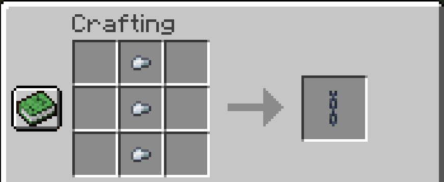

# Cheaper Chains

> A Minecraft 1.16.2+ data pack that makes chains cheaper (3 iron nuggets).

## Installation

Download the latest release from [here][latest] and put the datapack zip file into the `datapacks` folder of your Minecraft world.

## Crafting

    

## Uninstallation

The datapack doesn't create new scoreboards or new entities and thus an `uninstall` function is not needed.

## License

The data pack is licensed under the GPLv3. For more information, take a look at the license file within this repository.

[latest]: https://github.com/vanilla-friendly-datapacks/REPLACE/releases/latest
